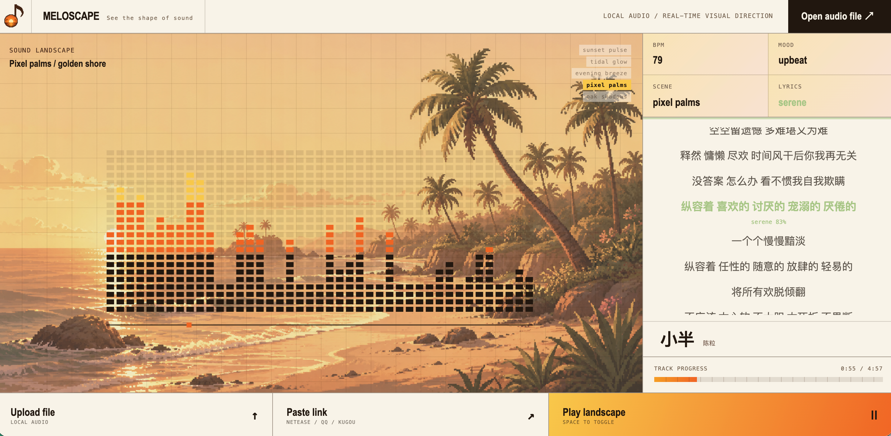

<h1 align="center">MELOSCAPE</h1>

<h3 align="center">实时音乐可视化 · 看见声音的形状</h3>

<p align="center">
  <a href="LICENSE"></a>
  
  
  
</p>

<p align="center">
  <a href="https://meloscape-inn2.vercel.app" target="_blank" rel="noopener noreferrer"><strong>即刻体验</strong></a>
</p>

<p align="center">
  
</p>

<p align="center">
  <a href="README.en.md">English Version</a>
</p>

Meloscape 是一个受像素艺术美学启发的实时音乐可视化 Web 应用。粘贴网易云音乐 / QQ 音乐 / 酷狗链接，或上传本地音频，它会根据节奏、情绪和歌曲结构自动生成并切换动态音景。

## 功能

- **多平台链接解析** — 网易云音乐、QQ 音乐、酷狗
- **实时音频分析** — BPM 检测、情绪估计、段落识别（前奏 / 主歌 / 副歌 / 桥段 / 尾奏）
- **5 个自动切换的反应式场景**
  - neon · 日落脉冲
  - golden · 潮汐微光
  - deepsea · 晚风低语
  - fractal · 像素棕榈
  - ink · 橡树阴影
- **本地代理服务器** — 绕过 CORS，代理音频流
- **多种输入方式** — 粘贴链接、拖拽音频、本地上传

## 技术栈

- 前端：原生 HTML5 + CSS3 + Canvas + Web Audio API
- 后端：Node.js 本地代理服务器
- 元数据：第三方网易云 API + QQ 音乐搜索兜底

## 本地运行

```bash
# 1. 克隆仓库
git clone https://github.com/Maropion03/audio-visualizer.git
cd audio-visualizer

# 2. 启动本地服务器（包含 API 代理）
./start.sh

# 3. 浏览器打开
# http://localhost:8765
```

或直接运行 Node：

```bash
node server.js
```

## 使用说明

1. 打开页面，点击 **Paste link** 粘贴音乐链接，或拖拽本地音频文件
2. 等待 1-3 秒，音景会自动随音乐变化
3. 按 `SPACE` 播放 / 暂停

## 项目结构

```
audio-visualizer/
├── index.html           # 单页应用
├── server.js            # Node.js 代理服务器
├── start.sh             # 一键启动脚本
├── meloscape-promo.png  # 宣传图
└── README.md            # 本文件
```

> 注意：`assets/` 文件夹用于存放背景图和 favicon，已加入 `.gitignore`，不会提交到仓库。首次运行前请自行准备或从 Release 下载。

## 说明

- 仅供学习和实验使用
- 部分曲目受版权 / VIP 限制可能无法解析
- 平台接口可能变动，若解析失败请尝试其他可用曲目

## 许可

MIT
